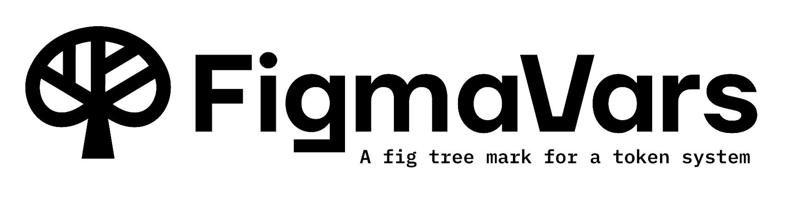

# @figma-vars/hooks

<p align="left">
  
</p>

A fast, typed React 19 hooks library for the Figma Variables API: fetch, update, and manage design tokens via the official [Figma REST API](https://www.figma.com/developers/api#variables).

Built for the modern web, this library provides a suite of hooks to fetch, manage, and mutate your design tokens, making it easy to sync them between Figma and your React applications, Storybooks, or design system dashboards.


[](https://codecov.io/gh/marklearst/figma-vars-hooks)


---

## 🚀 Features

- **✅ Token Agnostic for the Best DX**: Our library doesn't care _how_ you get your Figma token. Use environment variables, `localStorage`, a state management library, or even a simple input field. This framework-agnostic approach means it works seamlessly with Vite, Next.js, Create React App, and more, without locking you into a specific build tool.
- **⚛️ Modern React Hooks**: A full suite of hooks for fetching and mutating Figma variables, collections, and modes.
- **✍️ Ergonomic Mutations**: A `useMutation`-style API for creating, updating, and deleting variables, providing clear loading and error states.
- **🔒 TypeScript-first**: Strictly typed for an ergonomic and safe developer experience. Get autocompletion for all API responses.
- **📖 Storybook & Next.js Ready**: Perfect for building live design token dashboards or style guides.

---

## 📦 Install

```bash
npm install @figma-vars/hooks
# or
yarn add @figma-vars/hooks
# or
pnpm add @figma-vars/hooks
```

> **Peer dependencies:** You'll need `react` and `react-dom`.

---

## 🛠️ Setup & Usage

The library is designed to be as flexible as possible. You provide the Figma token and file key, and the hooks handle the rest.

Wrap your application (or the relevant component tree) with the `FigmaVarsProvider`. This makes the Figma token and file key available to all the hooks.

```tsx
// src/main.tsx or App.tsx
import React from 'react'
import ReactDOM from 'react-dom/client'
import { FigmaVarsProvider } from '@figma-vars/hooks'
import App from './App'

// The token can come from anywhere: .env, localStorage, state, etc.
const FIGMA_TOKEN = import.meta.env.VITE_FIGMA_TOKEN
const FIGMA_FILE_KEY = 'your-figma-file-key'

ReactDOM.createRoot(document.getElementById('root')!).render(
  <React.StrictMode>
    <FigmaVarsProvider
      token={FIGMA_TOKEN}
      fileKey={FIGMA_FILE_KEY}>
      <App />
    </FigmaVarsProvider>
  </React.StrictMode>
)
```

### Fetching Data

Now, you can use the query hooks anywhere in your app:

```tsx
// src/components/TokenList.tsx
import { useVariables } from '@figma-vars/hooks'

export function TokenList() {
  const { data, isLoading, error } = useVariables()

  if (isLoading) return <div>Loading tokens...</div>
  if (error) return <div>Error: {error.message}</div>

  // The 'data' object contains variables, collections, and modes
  const variables = Object.values(data?.variables ?? {})

  return (
    <ul>
      {variables.map((variable) => (
        <li key={variable.id}>
          {variable.name}: {JSON.stringify(variable.valuesByMode)}
        </li>
      ))}
    </ul>
  )
}
```

### Mutating Data

To create, update, or delete variables, use the provided mutation hooks. They follow a standard pattern, returning a `mutate` function and states for `data`, `isLoading`, and `error`.

Here's an example of creating a new variable:

```tsx
// src/components/CreateVariableForm.tsx
import { useCreateVariable } from '@figma-vars/hooks'

function CreateVariableForm({ collectionId, modeId }) {
  const { mutate, data, isLoading, error } = useCreateVariable()

  const handleSubmit = (event) => {
    event.preventDefault()
    const variableName = event.target.elements.variableName.value

    mutate({
      name: `colors/${variableName}`,
      collectionId: collectionId,
      valuesByMode: {
        [modeId]: { r: 1, g: 0, b: 0, a: 1 },
      },
    })
  }

  return (
    <form onSubmit={handleSubmit}>
      <input
        name="variableName"
        placeholder="New variable name"
      />
      <button
        type="submit"
        disabled={isLoading}>
        {isLoading ? 'Creating...' : 'Create Variable'}
      </button>
      {error && <p>Error: {error.message}</p>}
      {data && <p>Created variable with ID: {data.id}</p>}
    </form>
  )
}
```

### Figma PAT Security

When using the Figma API, it's essential to keep your Personal Access Token (PAT) secure. Here are some best practices:

- Never hardcode your PAT in your code.
- Use environment variables or a secure storage mechanism to store your PAT.
- Limit the scope of your PAT to only the necessary permissions.
- Rotate your PAT regularly.

### Advanced Usage

For advanced use cases, you can use the `useFigmaToken` hook to access the token and file key from the context.

```tsx
// src/components/AdvancedUsage.tsx
import { useFigmaToken } from '@figma-vars/hooks'

function AdvancedUsage() {
  const { token, fileKey } = useFigmaToken()

  // Use the token and file key to make custom API requests
  const apiRequest = async () => {
    const response = await fetch(
      `https://api.figma.com/v1/files/${fileKey}/variables`,
      {
        headers: {
          'X-Figma-Token': token,
        },
      }
    )

    const data = await response.json()
    console.log(data)
  }

  return <button onClick={apiRequest}>Make API Request</button>
}
```

### Error Handling

All hooks return an `error` state that you can use to handle errors.

```tsx
// src/components/ErrorHandling.tsx
import { useVariables } from '@figma-vars/hooks'

function ErrorHandling() {
  const { data, isLoading, error } = useVariables()

  if (error) {
    return (
      <div>
        <h2>Error</h2>
        <p>{error.message}</p>
      </div>
    )
  }

  // Render data or loading state
}
```

### Documentation Generation

This library uses TSDoc to generate documentation. You can find the generated documentation in the `docs` folder.

---

## 🧩 API Reference

### Core Hooks

- `useVariables()`: Fetches all local variables for the file key provided to the `FigmaVarsProvider`. Returns an object with `data`, `isLoading`, and `error` properties. The `data` object contains `variables`, `variableCollections`, and `modes` from the Figma API.
- `useVariableCollections()`: A convenience hook that returns just the variable collections from the main `useVariables` data.
- `useVariableModes()`: A convenience hook that returns just the variable modes from the main `useVariables` data.
- `useFigmaToken()`: A simple hook to access the token and file key from the context.

### Mutation Hooks

All mutation hooks return an object with the following shape: `{ mutate, data, isLoading, error }`.

- `useCreateVariable()`: Creates a new variable. The `mutate` function expects the variable data as its payload.
- `useUpdateVariable()`: Updates an existing variable. The `mutate` function expects an object with `id` and the `data` to update.
- `useDeleteVariable()`: Deletes a variable. The `mutate` function expects the `id` of the variable to delete.
- `useBulkUpdateVariables()`: Updates multiple variables in a single batch operation. The `mutate` function expects an array of variables to update.

### Types

All types are exported from `@figma-vars/hooks`. The core response type from Figma for local variables is `Variables_LocalVariablesResponse`.

---

## 📚 Storybook & Next.js Integration

The provider model makes integration trivial. Simply wrap your Storybook stories or Next.js pages with the `FigmaVarsProvider`.

```tsx
// In a Storybook story
import { FigmaVarsProvider, useVariables } from '@figma-vars/hooks'

export const TokensStory = () => (
  <FigmaVarsProvider
    token="YOUR_TOKEN"
    fileKey="YOUR_FILE_KEY">
    <TokenList />
  </FigmaVarsProvider>
)

const TokenList = () => {
  const { data } = useVariables()
  return <pre>{JSON.stringify(data?.variables, null, 2)}</pre>
}
```

---

## 📝 Contributing

PRs and issues are welcome! Please see [CONTRIBUTING.md](CONTRIBUTING.md) for guidelines.

## 📝 License

This project is licensed under the [MIT License](LICENSE).
© 2024–2025 Mark Learst
